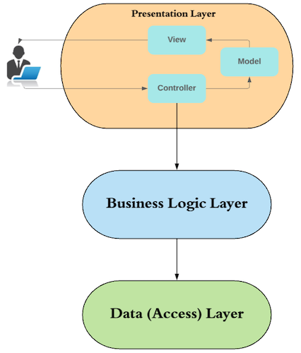
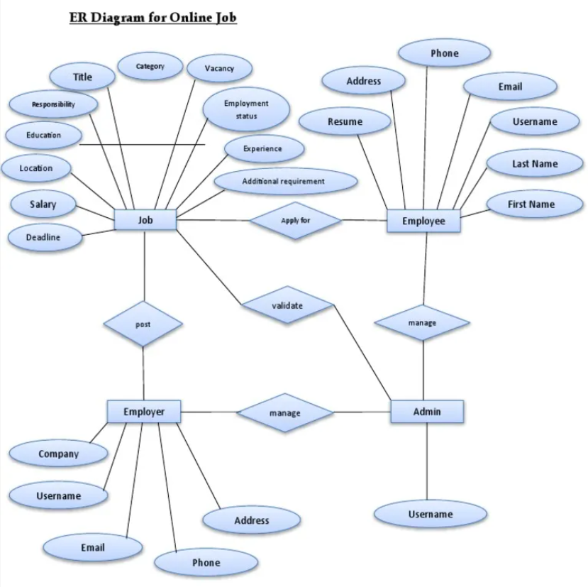

# 🚀 RevHire – Console-Based Job Portal Application

RevHire is a console-based job portal application that connects **Job Seekers** and **Employers**.  
The system simulates a real-world recruitment workflow using Java and Oracle Database with a clean layered architecture.

---

## 📌 Project Overview

RevHire allows:

- Employers to post jobs, manage applicants, and update candidate status.
- Job Seekers to search jobs, apply, manage resumes, and track application status.
- Real-time notification system.
- Secure authentication with password recovery.

Built using:
- Java
- JDBC
- Oracle 10g XE
- Layered Architecture (Controller → Service → DAO)

---

# 🏗 System Architecture

The project follows a **Layered Architecture Pattern**.

### 🔹 Layers

### 1️⃣ Presentation Layer
- Controller classes
- Handles user input/output

### 2️⃣ Business Logic Layer
- Service classes
- Handles validations, rules, workflows

### 3️⃣ Data Access Layer
- DAO classes
- Executes SQL queries using JDBC

---

# 🗄 Database Design

The system contains the following core tables:

- **USERS**
- **JOBS**
- **APPLICATIONS**
- **RESUMES**
- **NOTIFICATIONS**

---

# 📊 ER Diagram

### Relationships:

- One Employer → Many Jobs
- One Job → Many Applications
- One Job Seeker → Many Applications
- One User → One Resume
- One User → Many Notifications

Primary & Foreign Key relationships ensure referential integrity.

---

# 👨‍💼 Key Features – Job Seeker

- Register & Login
- Secure Password Reset (Security Question)
- Create / Update Resume
- Search & Filter Jobs
- Apply to Jobs
- Track Application Status
- Withdraw Application (Validation Enabled)
- Receive Notifications

---

# 🏢 Key Features – Employer

- Register & Login
- Post Jobs
- View Applicants
- View Resume Details
- Shortlist Candidates
- Reject Candidates
- Close / Reopen Jobs
- View Recruitment Analytics
- Receive Notifications

---

# 🔥 Advanced Features Implemented

- Duplicate Application Prevention
- Withdrawal Validation (Cannot withdraw if shortlisted/rejected)
- Job Status Filtering (OPEN / CLOSED)
- Resume Management Module
- Notification System with Read/Unread Tracking
- Recruiter Analytics Dashboard
- Role-Based Access Control
- Secure Password Hashing

---

# 🔄 Application Workflow

### 👨‍💼 Employer Workflow
Post Job → View Applicants → Shortlist / Reject → Notify Candidate

### 👩‍💻 Job Seeker Workflow
Search Job → Apply → Track Status → Receive Notification

---

# 🛠 Tech Stack

| Layer | Technology |
|-------|------------|
| Language | Java |
| Database | Oracle 10g XE |
| Connectivity | JDBC |
| IDE | IntelliJ IDEA |
| Version Control | Git & GitHub |

---

# 📂 Project Structure
src/main/java/com.revhire
│
├── config
├── controller
├── dao
├── model
├── service
├── util
└── Main.java

---

# 🚀 Future Enhancements

- Web-based UI using Spring Boot
- REST API Integration
- Email Notifications
- Resume File Upload
- Admin Dashboard
- JWT Authentication
- Microservices Migration

---

# 📈 Real-World Relevance

This system simulates:

- HR Management Systems
- Recruitment Platforms
- Applicant Tracking Systems (ATS)

The architecture is easily scalable to Spring Boot or Microservices.

---

# 👨‍💻 Author

Developed by: **Shaik Riyaz**

---

